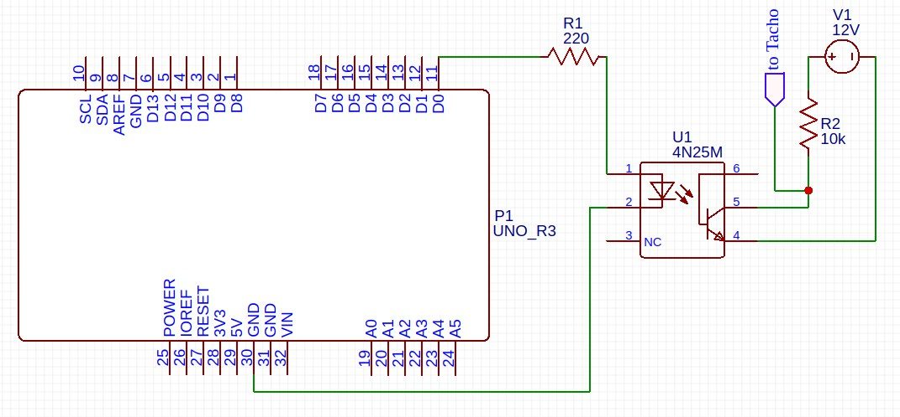

# tacho_checker
Analog tachometer checker using arduino tone and optocoupler.

# equation
frequency (Hz) = RPM * cylinders/120

# wiring diagram:

# how to use
- wire according to the picture, use any digital pin.
- change pin number in the code.
- upload and run.
